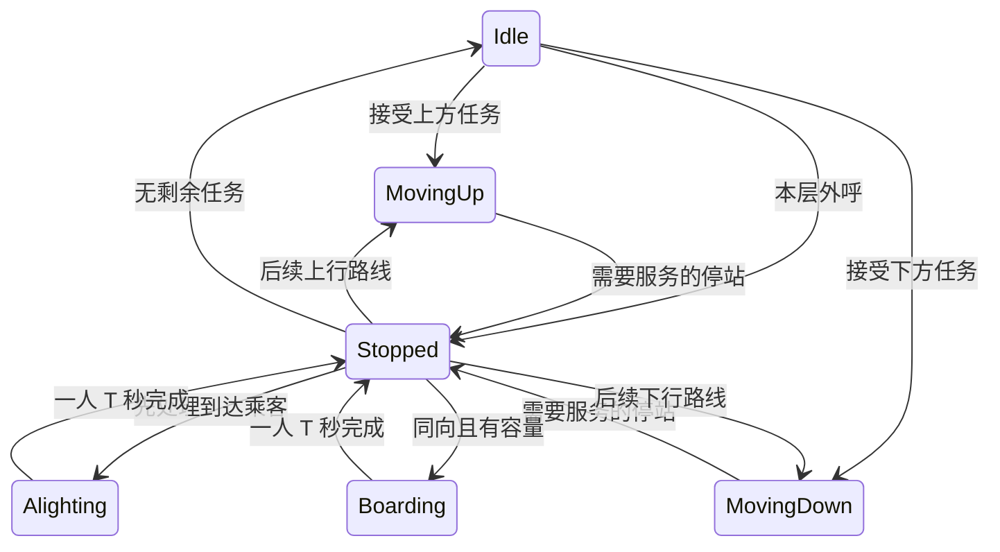

# 核心仿真算法与接口设计

## 1. 调研依据与选择

初版核心实现参考了以下论文、课程资料和厂商文档；本次改动对照现有源码和回归测试，增加有限联合分配与滞回改派。下列来源用于算法思想，代码为本项目实现，没有复制博客程序。

| 方案 | 思想 | 优点 | 局限与本项目选择 |
| --- | --- | --- | --- |
| 方向集选 collective control | 按行进方向服务已有内部目标及同向外呼 | 容易解释，符合方向保持规则 | 单独使用不能完成多梯分配；作为单梯基础 |
| SCAN / LOOK | 保持扫描方向，LOOK 到最后待处理位置才折返 | 不因新请求立即反向；避免无任务仍走到端点 | 这是借用课程中的扫描思想，不能直接把磁盘算法当成完整电梯控制器 |
| nearest-car | 选择距离较近的可响应梯 | 简单，适合作为比较基线 | 单纯绝对距离忽略返程、停靠与负载；不作为最终选择器 |
| ETA | 预演当前任务与已知 FIFO 乘客的接客时间 | 能表达反向绕行、上下客及容量变化 | 未来新增乘客及后续分配可能改变路线，不保证未来实际到达时间 |
| 代价式 Hall Call Assignment | 按 ETA、负载等因素对所有电梯评分 | 可解释、可拆分测试 | 不声称全局最优；避免大量无单位权重 |

主要来源：

1. [Richard Peters, Elevator Dispatching, ELEVCON 2014](https://download.peters-research.com/library/Elevator_Dispatching.pdf)：方向集选、最近梯、ETA 的比较，强调中间停靠对响应时间的影响。
2. [Siikonen, Elevator Group Control with Artificial Intelligence](https://sal.aalto.fi/publications/pdf-files/rsii97a.pdf)：参考其集选、任务方向保持与群控背景；没有实现其中的 AI 策略。
3. [University of Pittsburgh, Disk Scheduling 课程资料](https://people.cs.pitt.edu/~pranut/OLD/CS1550/WeekFinal/Recitation%20-%20Final%20Week.pdf)：SCAN 与 LOOK 的扫描终点区别。
4. [Nidec / MCE, Motion Group Control 技术手册](https://acim.nidec.com/elevators/-/media/Project/Nidec/NidecElevator/MCE/PDFs/Motion-Group-Control-B5.pdf)：以响应时间及时间形式的附加项表达分配偏好。本项目未复制其厂商参数。
5. [Peters 等，A Systematic Methodology for the Generation of Lift Passengers under a Poisson Batch Arrival Process](https://joomla.peters-research.com/index.php/support/articles-and-papers/163-a-systematic-methodology-for-the-generation-of-lift-passengers-under-a-poisson-batch-arrival-process)：参考指数间隔与乘客到达模型比较。本项目取单人齐次 Poisson 简化，没有使用批量到达或固定总人数的时间伸缩校正。

## 2. Dispatcher：统一 Cost/ETA + LOOK 路线

`SelectElevator(floor, direction, const vector<Elevator>&)` 保留原签名与无副作用职责。先生成只读 `ElevatorDispatchSnapshot`，再调用同一套 `SelectFromSnapshots` 评分。后者也用于构造明确的测试场景，无需为测试开放 private 字段。

候选排除：非法楼层/方向、顶层向上或底层向下、非有限时间参数、无效任务/服务快照，以及预演到请求层完成下客后仍无空位的梯。当前满载梯若预测在请求层接客前释放容量，可以参与候选；若到请求层仍满载，则不分配。全组无法分配时返回 `InvalidElevatorId`。

空闲梯与同向顺路梯不再使用绝对优先等级，而是统一计算成本。方向因素保留为有限的策略成本：同向顺路和空闲梯方向成本为 0；请求不在当前行进方向前方的忙碌梯增加 `S+T`。实际折返、中间停靠和当前动作剩余时间仍由 ETA 计算，因此该附加项用于表达反向/非顺路风险，不是把顺路梯硬排在空闲梯之前。

比较键按以下顺序排列，前一项不同就不比较后一项：

1. AdjustedCost（仿真秒），下式中的 ETA、预计负载、方向成本与有上限的 Aging 折扣。
2. ETA（仿真秒），即可以开始服务该外呼的时间，包含当前动作剩余时间、中间服务、移动以及请求层必须先完成的下客；不包含该外呼自身的上梯 T。
3. 当前整数楼层至请求楼层的绝对距离。
4. 上下行任务集合的元素总数。
5. 电梯 ID；完全相同的重复 ID 输入最终保持容器先后顺序。

```text
ETA = 当前动作剩余时间 + 后续移动层数 × S + 后续实际上下客人数 × T
LoadCost = T × 请求层完成下客后的 projectedOccupancy / capacity
DirectionCost = 空闲或顺路时为 0，否则为 S + T
AgingBonus = min(8.0, max(0, currentTime - firstRequestTime) × 0.05)
AdjustedCost = ETA + LoadCost + max(0, DirectionCost - AgingBonus)
```

路线与 `Elevator::HasTasksAhead` / `ChooseActionAtFloor` 保持同样的规则：所有内呼、Up 外呼和 Down 外呼共同决定当前方向是否还有前方任务；内呼在抵达时停站，外呼只在服务方向一致时停站。方向前方只有反向外呼时，仍须走到那个折返点，不能提前反向。例如 5F↑、8F↓ 外呼和新请求 3F↑，必须先到 8F 再回 3F。层间运行先完成已开始路段，不能因新请求立刻回头。空闲梯按接第一个外呼时的方向开始。

调度只使用快照副本。`StopService` 的 Idle 记录表示内呼/下客（0 人仍可表示内部停靠）；Up/Down 记录表示外呼及对应队列。Simulation 按已分配的 `(floor, direction)` 读取 Floor 的真实 FIFO 人数及 Passenger 的 `targetFloor`，写入 `boardingCount` 和 `boardingTargetFloors`。目标层只复制最多 capacity 人的前缀，因为一次服务不可能登梯更多乘客；Dispatcher 不访问 Passenger、Floor 或 Simulation。

容量从 `passengerCount + reservedBoardingCount` 开始。真正停站时先消费已知下客，逐人增加 T 并将这批计数清零；返程再经过该层不能重复释放席位或重复计时。随后按 `min(boardingCount, capacity - projectedOccupancy)` 取 FIFO 前缀上梯，逐人增加 T，并将这些人的目标层加入局部内呼与下客计数。新乘客可以产生同一楼层的新一批下客，清零不代表永久禁止再次服务该层。未登梯者仍留在真实 Floor 队列，归 Simulation 后续重分配，不在本次预演中重复登梯。

Alighting 进行中时，当前一人仍包含在乘客数和该层下客计数里：先用 `remainingActionTime` 完成他，并从两个计数中各减一；同层其他人再各计完整 T。Boarding 进行中时，预留者已占据预测席位且其未来目标已由 Elevator 写入下客事件；Simulation 从队列人数及 FIFO 目标前缀中跳过这名队头乘客。旧 `SelectElevator` 入口也不将这名预留者再次估成一名等待者。

所有计时来自当前 S/T。LoadCost 使用接客前的预计载荷，上限为一个 T；当前乘客已经在途中下梯时不会继续产生当前负载惩罚。Aging 保持原有连续斜率和 8 秒上限，仅抵消有限方向成本；Simulation 仍先处理队头等待时间最早的未分配外呼。不能承诺所有客流均优于最近梯，也不声称全局最优。

兼容性：原 `SelectElevator` 及 `SelectFromSnapshots` 签名不变，新增目标列表允许为空。只有人数的旧快照按容量计实际上客时间，但不凭空推测他们的下客楼层；有完整信息的 Simulation 使用目标层前缀。非法目标层、方向不匹配或目标数超过等待人数的快照被拒绝。

验证包含手算成本的上下阈值、真实 Elevator 动作推进对照、108 组混合任务路线、双向经过同层的事件消费，以及 Simulation 真实 FIFO/Boarding 端到端用例。

### 带滞回的动态重分配

`ScoreSnapshot` 提供可行性、ETA、Cost 和预计人数，供原选择器、改派和联合分配共用；没有新增第二套 ETA。`SelectReassignment` 先计算原梯评分，再在其他可行候选中按 ETA、Cost、距离、任务数、ID 选择最好者。原梯可行时要求 `CurrentETA - BestETA >= ReassignThresholdSeconds`；原梯预测到请求层无座位时允许立即寻找替代，绕过普通临近锁、冷却和收益阈值，其他梯仍须通过完整容量校验。没有可行替代时保留归属，等待后续事件。

阈值统一在 Dispatcher.h：收益阈值 5 仿真秒、`ReassignLockDistanceFloors=1`、`ReassignCooldownSeconds=10`。请求层真正 Stopped/Boarding/Alighting 且非 betweenFloors 始终保护，不能抢走传送中的乘客。其余情况下只有可行原梯使用普通保护：冷却自实际改派开始；临近锁要求 betweenFloors、MovingUp 且请求层在上方，或 MovingDown 且请求层在下方，并且整数楼层距离 <=1。currentFloor 相同但已驶离、相邻却正在远离或尚未移动，都不构成“正在接近”。

Simulation 在新乘客、到达楼层、上下客完成及服务状态变化时置 `m_dispatchDirty`。纯 Update 帧边界不置脏，因此不会因帧率或 Aging 的连续时间变化额外抢单。一个仿真时刻只对已分配请求评估一轮，按楼层/方向稳定顺序处理；可行原梯在冷却期内不能反向抢回。不可行原梯可在下一个事件重评估时立即改派，但仍不绕过同一时刻只评估一轮的约束。

提交时仅针对已选中的两台梯准备副本：旧梯 `RemoveHallCall`，新梯 `AddHallCall`，成功后通过 noexcept 移动回写并同步 `assignedElevatorId` / `lastReassignmentTime`。准备期间失败不留下半次改派。此副本仅用于提交，候选搜索从不调用真实 Elevator 来试组合。撤销接口只删除指定方向 Hall Call；当前层 Stopped/Boarding/Alighting 禁止，Moving 中已离开的整数层允许撤销。它不改变当前动作、方向、计时或内呼任务，下一次正常事件仍由原状态机决定继续/折返。

### 最老三个请求的有限联合分配

Simulation 按 `firstRequestTime`、队头 PassengerId、楼层/方向排序，每批规划仅取最老的 3 个未分配外呼。同一 DispatchCalls 内提交可行分配后重新收集 pending、重建完整快照并规划下一批，不等待下一次物理事件。直到无 pending 或当前批次 assignedCount=0 退出。成功批次至少分配一个请求且不新增 pending，因此最多初始 pending 数个成功批次，加至多一个失败批次，零时间循环必然结束。最老批次全部不可行时按约定停止，即使后面的请求可能可行，也留待后续事件。HallCallDispatchSnapshot 只携带请求标识、队头时间、等待人数和 FIFO 目标层值。

每层递归先根据前面已经插入的任务重新评分全部 N 台梯，再保留最优 3 台；连同“暂不分配”分支，深度最多 3、叶组合最多 `(3+1)^3=64`，不是 N³。搜索只维护局部快照，给空闲梯插入第一项任务时记录与真实 AddHallCall 相同的起步方向和当前路段，后续请求不能重新选择该起步方向。同梯接多个请求时，已知上客和目标层均参与之后的 ETA/容量预测。

叶组合重新计算所有已选请求在最终路线下的 ETA 和预计载荷，防止只累加“插入时成本”而漏掉后续任务对早先请求的影响。方向惩罚保留各请求插入前的上下文（包括 Aging），避免把原来空闲梯的首项任务事后重复惩罚；ETA 和 LoadCost 使用最终路线数值。

先寻找可分配数量最多的可行方案，避免全不分配的零成本方案胜出；数量相同时按总 AdjustedCost、最大单请求 ETA、总 ETA、最老请求顺序中的电梯 ID 比较。没有足够容量时允许部分请求保持 -1。重复电梯 ID 则稳定保持输入顺序；未分配在 ID 比较中置于已分配之后。

两请求反例：S=2、T=3、capacity=10，E1 在 5F、E2 在 1F 且均空闲，最老请求 4F↑→20F，随后 6F↑→20F。贪心先选 E1 响应 4F（2 秒），E1 已向下起步且存在后续服务，使 6F 请求选 E2（10 秒），总成本 12 秒。联合分配先让 E2 接 4F（6 秒）、E1 接 6F（2 秒），总成本 8 秒；不能据此推断任意客流更优。

### 固定基线对照与性能

下表是 `0fade61` 对 `e7b96a6` 联合分配初版的历史实测，不是本轮边界修复后的结果。脚本仍可用于对当前源码重新测量；本轮双架构回归与压力测试结果见 README。

运行 `powershell -NoProfile -ExecutionPolicy Bypass -File Tests/RunDispatchComparison.ps1 x64`。脚本通过 git archive 导出基线提交 `0fade614d5095eb14b3cb63916af876f3d2e1aa3` 的源码，只写 build，不改分支。两版使用同一 `DispatchComparison.cpp`、同一 MSVC x64 `/O2 /MD`、seed=321；每场景运行 3 次取平均运行耗时，不含编译。支持将参数改为 x86。脚本使用 UTF-8 BOM，生成批处理为 UTF-8/CRLF 并设置代码页 65001，支持中文仓库路径。

| 场景 | 平均等待旧/新（仿真秒，含上梯 T） | 已完成接客延迟总和旧/新（仿真秒，不含自身上梯 T） | 本机运行时间旧/新（ms） |
| --- | --- | --- | --- |
| L=20、N=3、K=4；同时 9F→20F、11F→1F | 13 / 12 | 20 / 18 | 0.031 / 0.086 |
| 同配置；0 秒 15F→20F，2 秒新增 17F→1F | 41 / 12 | 76 / 18 | 0.015 / 0.038 |
| 90 人批次，N=6、K=3、S=0.5、T=0.25 | 13.0889 / 13.1806 | 1155.50 / 1163.75 | 1.07 / 11.76 |
| 2000 人，同批次规则 | 306.5200 / 304.2986 | 612540.00 / 608097.25 | 54.14 / 356.12 |
| N=6、K=4、S=0.3、T=0.2、λ=8、600 秒 | 60.5609 / 62.2858 | 205347.68 / 213078.39 | 91.23 / 4043.81 |

有限场景全部送达。高客流两版均生成 4815 人，旧/新分别送达 3381/3418，队列等待 1413/1383，仍在乘梯 21/14；已上梯均值及响应延迟总和的样本数量不同，不能直接视为全体等待改善。90 人场景存在退化，运行开销普遍增加。

每批三请求搜索至多 21N 次前缀候选评分，加至多 192 次叶请求复评；单次 ETA 自身还随已有任务和可上客人数增长。DispatchPlan 返回 evaluatedCombinations / scoreEvaluations 供检查；60 台电梯回归确认单批组合仍不超过 64。一次事件可执行多个批次，64 不是整次事件的上限。每轮改派还需约 H×N 次评分（H 为已分配外呼数），成功改派后重建快照；多批分配期间不重复改派。历史初版约 4 秒跑完 600 仿真秒仅是本机结果，不是实时性能保证。

## 3. Elevator：方向保持与动作事件

沿用原状态，不添加第二套运行枚举：



`AddHallCall` 只接收已经由 Simulation 分配的外呼；`AddInternalTarget` 接收内部停靠。分别保存上下行外呼和内部目标，公共上下行任务查询为这些任务的合并只读视图。内部乘客只存 ID，另存 ID→目标楼层数值，不保存 Passenger 地址。

`RemoveHallCall` 是本次唯一新增的单梯操作：请求在当前楼层或不存在时返回 false；否则只撤销该方向外呼并重建任务视图。同层内呼、另一方向外呼、乘客及当前动作时间都保留。其余状态机代码未修改。

新请求在非 Idle 状态只登记任务，不修改方向或重置当前计时。电梯到达整层、本次停站完成后才能决定继续或折返。只要前方仍有已接受任务，就保持扫描方向；逆向外呼在前方时会在回程或该扫描的折返点服务。空车为了接人可以先朝呼叫楼层移动，再在允许折返的位置采用乘客方向。

`Advance(simulationSeconds)` 最多推进到一个动作完成事件，返回 `ElevatorEvent.elapsedTime`。调用者必须处理事件，再继续剩余预算；不能把大预算当作已全数消耗。`GetTimeToNextEvent()` 返回下一层或本次一人传送的剩余秒数，Idle/Stopped 没有自行完成的定时动作，返回 infinity。

移动完成才更新整数楼层；上下客每次仅一人、均耗时 T。`BeginBoarding` 检查方向、目标、重复 ID、容量以及是否还有未下完的乘客，并预留一席。完成 T 后才加入乘客 ID 和内部目标。下客同样在 T 完成后移除 ID。在传送过程中不允许 `FinishStop`；存在到站乘客时不得先上客或离站。

没有独立开门/关门耗时，也没有加减速模型。Stopped 是交给总控制器处理的事件边界，通常在同一时刻立即进入下一项有效动作。

## 4. Simulation：事件推进与外呼生命周期

UI 只传真实秒；唯一乘倍速的位置是 `Simulation::Update`。本轮最大仿真增量先截断到总时长。每次取以下最小时间间隔，同时推进全部电梯：本轮 Update 剩余时间、下一名乘客到达、各梯下一动作完成时间。

同一时刻先处理全部电梯完成事件（稳定按 ID），再产生到达乘客，最后进行分配和停站处理。每次停站先下后上；开始 Boarding/Alighting 只是登记计时，完成必须等待后续事件。零耗时决策循环不会消耗 S/T，并设有依任务数计算的收敛保护，错误不会被静默忽略。

Hall Call 用 `(真实楼层, Up/Down)` 作为唯一键。每个方向外呼最多一台负责梯，尚未分配时 ID=-1。同一方向后来产生的乘客加入同一 FIFO 队列；待分配外呼按最老三个连续分批规划。已分配请求在事件触发时按上述服务锁、原梯可行性及滞回条件改派，不在每帧反复抢单。

上梯传送过程中乘客仍留在队头，其他电梯不能通过同一外呼抢走它；T 完成才出队并变为 Riding。满载离站后，只清除这一台电梯的外呼任务，残余队列仍存在，负责梯重置为 -1，并以剩余队头时间重新进入调度。所有候选梯预测到请求层仍满载时，请求保持未分配并在后续事件时重试。

Passenger 仍由 Simulation 的注册表按值唯一拥有。同一轮 ID 从 0 递增，已到达后不复用；达到类型上限时明确失败。下梯完成时 Elevator 先移除 ID，Simulation 更新 Passenger 与 Statistics 后删除活动对象。`ValidateState()` 提供只读人数守恒、队列/轿厢 ID 唯一性、状态及外呼归属诊断。

随机模型：`passengerRate = λ` 为**全楼平均人数 / 仿真秒**；`Δt = -ln(U)/λ`，U 严格位于 (0,1)。起点在 1~L 均匀取样，终点从另外 L-1 层均匀取样；0 速率表示不随机生成。产生人数不被强制等于 λ×时长。`mt19937` 归 Simulation 持有，改变帧大小不会重新抽样。`Initialize(config, seed)` 指定种子；无 seed 的原接口获取随机种子，`GetRandomSeed()` 可记录，`Reset()` 重用本轮 seed。复现以相同实现/工具链为准，不承诺不同标准库的分布实现逐位相同。

允许在 Ready/Running/Paused 时用 `AddPassenger` 在当前时刻手工加入乘客，供测试或后续演示使用。非法输入不消耗 ID，Uninitialized/Finished 禁止注入。

时间区间约定：随机到达只产生于 `[0, simulationDuration)`；恰好在截止时刻完成的移动/上下客会计入，但绝不把时间推进到截止之后。截止时仍在等待、乘梯或传送中的乘客保持活动状态，用于统计积压，不自动延长到全员送达。

## 5. 统计口径

沿用唯一 Statistics，采用事件通知，不反向控制仿真：创建、上梯完成、下梯完成、移动完成、各状态经过的时间。

- Waiting 包括正在进行上梯传送的乘客，Riding 包括正在下梯传送的乘客。
- 等待时间 = 上梯完成时间 − 请求时间；已上梯乘客为均值样本，包含其上梯 T。
- 乘梯时间 = 下梯完成时间 − 上梯完成时间；已到达乘客为均值样本，包含下梯 T。
- 最大等待时间只统计已上梯者；尚在等待的队列不能混入该已完成样本均值。
- `total = waiting + riding + arrived`，`boarded = riding + arrived`。
- 各梯统计已送达人数、完成的移动层数、其中空载层数、Idle 秒数及实际人数等于 K 的满载秒数。上梯预留席位影响调度，但未完成上梯时不算实际满载时长。

评价算法必须同时报告送达量、截止积压和等待/乘梯时间；不能只拿已服务样本的低均值证明高客流性能好。

## 6. 当前边界

没有神经网络、强化学习、遗传算法、粒子群或复杂预测；没有数据库、网络业务或多线程。当前仅使用阈值改派与最多三请求的有限搜索，不含分区停车、峰值交通学习或严格等待时间上界。超出服务能力的持续输入会积压，有限批次则应在足够时长内清空。

联合搜索只覆盖最老三请求及每个前缀的前三候选，会遗漏截断以外的更优组合；它不优化已分配其他请求的全局总等待。动态改派优化单个请求的 ETA，可能增加其他乘客等待或旧梯的空驶；距离锁和冷却也可能错过短暂机会。不能同时保证所有样本等待下降、全局最优和常数开销。

ETA 固定本次快照中的已分配任务和已知队列。未来新增乘客、新分配外呼以及剩余队列重分配可能改变路线，因此预测不等于未来实际响应时间。这种局部评分也不保证群控全局最优；有上限的 Aging 不能在持续超载时给出有限等待保证。

UI 仍是初始化快照窗口，不自动启动或持续调用 Update；正式按钮、参数输入和动画由 UI 模块后续实现。核心动态状态已可通过原三类 Snapshot 及新增乘客/外呼快照读取。
