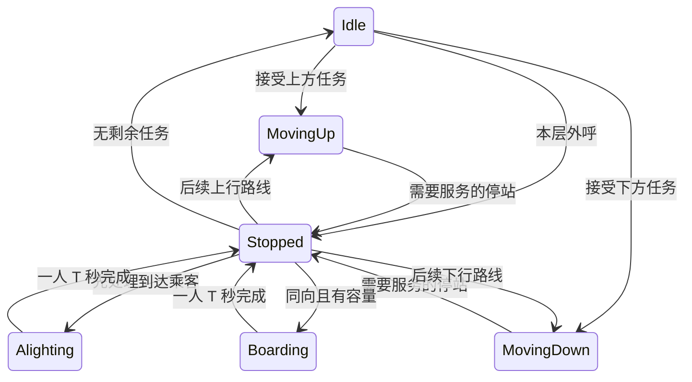

# 核心仿真算法与接口设计

## 1. 调研依据与选择

本轮先阅读现有公共契约，再联网检索论文、课程资料和厂商文档，最后实施代码。下列来源用于算法思想，代码为本项目实现，没有复制博客程序。

| 方案 | 思想 | 优点 | 局限与本项目选择 |
| --- | --- | --- | --- |
| 方向集选 collective control | 按行进方向服务已有内部目标及同向外呼 | 容易解释，符合方向保持规则 | 单独使用不能完成多梯分配；作为单梯基础 |
| SCAN / LOOK | 保持扫描方向，LOOK 到最后待处理位置才折返 | 不因新请求立即反向；避免无任务仍走到端点 | 这是借用课程中的扫描思想，不能直接把磁盘算法当成完整电梯控制器 |
| nearest-car | 选择距离较近的可响应梯 | 简单，适合作为比较基线 | 单纯绝对距离忽略返程、停靠与负载；不作为最终选择器 |
| ETA | 估计沿当前任务路线到呼叫楼层的时间 | 能表达反向绕行与中间停靠 | 尚未上梯乘客的目的地和人数未知，估计不等于真实到达时间 |
| 代价式 Hall Call Assignment | 按 ETA、负载等因素对所有电梯评分 | 可解释、可拆分测试 | 不声称全局最优；避免大量无单位权重 |

主要来源：

1. [Richard Peters, Elevator Dispatching, ELEVCON 2014](https://download.peters-research.com/library/Elevator_Dispatching.pdf)：方向集选、最近梯、ETA 的比较，强调中间停靠对响应时间的影响。
2. [Siikonen, Elevator Group Control with Artificial Intelligence](https://sal.aalto.fi/publications/pdf-files/rsii97a.pdf)：参考其集选、任务方向保持与群控背景；没有实现其中的 AI 策略。
3. [University of Pittsburgh, Disk Scheduling 课程资料](https://people.cs.pitt.edu/~pranut/OLD/CS1550/WeekFinal/Recitation%20-%20Final%20Week.pdf)：SCAN 与 LOOK 的扫描终点区别。
4. [Nidec / MCE, Motion Group Control 技术手册](https://acim.nidec.com/elevators/-/media/Project/Nidec/NidecElevator/MCE/PDFs/Motion-Group-Control-B5.pdf)：以响应时间及时间形式的附加项表达分配偏好。本项目未复制其厂商参数。
5. [Peters 等，A Systematic Methodology for the Generation of Lift Passengers under a Poisson Batch Arrival Process](https://joomla.peters-research.com/index.php/support/articles-and-papers/163-a-systematic-methodology-for-the-generation-of-lift-passengers-under-a-poisson-batch-arrival-process)：参考指数间隔与乘客到达模型比较。本项目取单人齐次 Poisson 简化，没有使用批量到达或固定总人数的时间伸缩校正。

## 2. Dispatcher：统一 Cost/ETA + LOOK 路线

`SelectElevator(floor, direction, const vector<Elevator>&)` 保留原签名与无副作用职责。先生成只读 `ElevatorDispatchSnapshot`，再调用同一套 `SelectFromSnapshots` 评分。后者也用于构造明确的测试场景，无需为测试开放 private 字段。

候选排除：非法楼层/方向、顶层向上或底层向下、无剩余座位（含正在上梯的一席预留）、非有限时间参数、无效任务快照。不假设当前满载梯到站前一定有人下梯；全组无法分配时返回 `InvalidElevatorId`。

空闲梯与同向顺路梯不再使用绝对优先等级，而是统一计算成本。方向因素保留为有限的策略成本：同向顺路和空闲梯方向成本为 0；请求不在当前行进方向前方的忙碌梯增加 `S+T`。实际折返、中间停靠和当前动作剩余时间仍由 ETA 计算，因此该附加项用于表达反向/非顺路风险，不是把顺路梯硬排在空闲梯之前。

比较键按以下顺序排列，前一项不同就不比较后一项：

1. Cost（仿真秒）= ETA + 方向成本 + 负载成本。
2. ETA（仿真秒），即当前动作完成、LOOK 路线移动及已有中间停站服务的预计接客时间。
3. 当前整数楼层至请求楼层的绝对距离。
4. 上下行任务集合的元素总数。
5. 电梯 ID；完全相同的重复 ID 输入最终保持容器先后顺序。

```text
Cost = ETA
     + 按 LOOK 路线到请求的移动时间
     + 请求之前预演的已有停靠数 × T
     + (当前载客人数 + 上梯预留人数) / K × T
     + 非顺路忙碌梯的方向成本（S+T）
```

空闲梯直接按距离 × S 估计；层间运行的电梯必须先完成当前剩余路段，然后再预演。任务只复制到局部集合：把新请求加入其方向，先走完当前方向，再考虑反向；同向但位于后方的请求必要时经历再次折返。中间停靠暂按每站处理一人估计；当前仍在服务的站点与剩余动作可能产生保守估计。这是可解释的 ETA 近似，不是未来队列的精确模拟。

方向成本与实际绕行距离共同表达方向因素，不使用任意大的绝对优先级。负载附加项被限制在一个 T 的范围内，任务影响通过停靠服务时间表达。所有时间来自实际 S/T 配置。

> 下方关于“严格等级优先”的文字是上一版策略的历史记录；当前规则以本节开头的统一 Cost/ETA 说明及第 3 节前的 Dispatcher 规则注释为准。

**严格等级优先是题目策略，不是最短等待时间的全局优化。** 因此一台较远的顺路梯也可能优先于就在呼叫楼层的空闲梯。持续高负载时这可能不如完全按 ETA 排序，不能承诺所有客流均优于最近梯。测试中的可解释反例：5F 上行至 15F 的梯响应 10F↑ 用 10 秒；仅距呼叫 1 层、但必须先下行至 2F 的 9F 梯需要 30 秒。两者均由真实单梯状态机推进获得，不只是比较评分。

## 3. Elevator：方向保持与动作事件

> **当前 Dispatcher 规则（覆盖本节前述历史说明）：** 空闲梯与同向顺路梯统一按 `Cost`、`ETA`、距离、任务数、ID 比较；非顺路忙碌梯增加有限 `S+T` 方向成本。方向因素不再构成绝对优先级，因而请求楼层的空闲梯可以优先于远处顺路梯。

沿用原状态，不添加第二套运行枚举：



`AddHallCall` 只接收已经由 Simulation 分配的外呼；`AddInternalTarget` 接收内部停靠。分别保存上下行外呼和内部目标，公共上下行任务查询为这些任务的合并只读视图。内部乘客只存 ID，另存 ID→目标楼层数值，不保存 Passenger 地址。

新请求在非 Idle 状态只登记任务，不修改方向或重置当前计时。电梯到达整层、本次停站完成后才能决定继续或折返。只要前方仍有已接受任务，就保持扫描方向；逆向外呼在前方时会在回程或该扫描的折返点服务。空车为了接人可以先朝呼叫楼层移动，再在允许折返的位置采用乘客方向。

`Advance(simulationSeconds)` 最多推进到一个动作完成事件，返回 `ElevatorEvent.elapsedTime`。调用者必须处理事件，再继续剩余预算；不能把大预算当作已全数消耗。`GetTimeToNextEvent()` 返回下一层或本次一人传送的剩余秒数，Idle/Stopped 没有自行完成的定时动作，返回 infinity。

移动完成才更新整数楼层；上下客每次仅一人、均耗时 T。`BeginBoarding` 检查方向、目标、重复 ID、容量以及是否还有未下完的乘客，并预留一席。完成 T 后才加入乘客 ID 和内部目标。下客同样在 T 完成后移除 ID。在传送过程中不允许 `FinishStop`；存在到站乘客时不得先上客或离站。

没有独立开门/关门耗时，也没有加减速模型。Stopped 是交给总控制器处理的事件边界，通常在同一时刻立即进入下一项有效动作。

## 4. Simulation：事件推进与外呼生命周期

UI 只传真实秒；唯一乘倍速的位置是 `Simulation::Update`。本轮最大仿真增量先截断到总时长。每次取以下最小时间间隔，同时推进全部电梯：本轮 Update 剩余时间、下一名乘客到达、各梯下一动作完成时间。

同一时刻先处理全部电梯完成事件（稳定按 ID），再产生到达乘客，最后进行分配和停站处理。每次停站先下后上；开始 Boarding/Alighting 只是登记计时，完成必须等待后续事件。零耗时决策循环不会消耗 S/T，并设有依任务数计算的收敛保护，错误不会被静默忽略。

Hall Call 用 `(真实楼层, Up/Down)` 作为唯一键。每个方向外呼最多一台负责梯，尚未分配时 ID=-1。同一方向后来产生的乘客加入同一 FIFO 队列；优先处理队头请求时间最早的待分配外呼，时间相同按队头 PassengerId 稳定排序。已分配请求保持归属，不在每帧反复抢单。

上梯传送过程中乘客仍留在队头，其他电梯不能通过同一外呼抢走它；T 完成才出队并变为 Riding。满载离站后，只清除这一台电梯的外呼任务，残余队列仍存在，负责梯重置为 -1，并以剩余队头时间重新进入调度。全部满载时请求保留，后续完成下客释放容量后重试。

Passenger 仍由 Simulation 的注册表按值唯一拥有。同一轮 ID 从 0 递增，已到达后不复用；达到类型上限时明确失败。下梯完成时 Elevator 先移除 ID，Simulation 更新 Passenger 与 Statistics 后删除活动对象。`ValidateState()` 提供只读人数守恒、队列/轿厢 ID 唯一性、状态及外呼归属诊断。

随机模型：`passengerRate = λ` 为**全楼平均人数 / 仿真秒**；`Δt = -ln(U)/λ`，U 严格位于 (0,1)。起点在 1~L 均匀取样，终点从另外 L-1 层均匀取样；0 速率表示不随机生成。产生人数不被强制等于 λ×时长。`mt19937` 归 Simulation 持有，改变帧大小不会重新抽样。`Initialize(config, seed)` 指定种子；无 seed 的原接口获取随机种子，`GetRandomSeed()` 可记录，`Reset()` 重用本轮 seed。复现以相同实现/工具链为准，不承诺不同标准库的分布实现逐位相同。

允许在 Ready/Running/Paused 时用 `AddPassenger` 在当前时刻手工加入乘客，供测试或后续演示使用。非法输入不消耗 ID，Uninitialized/Finished 禁止注入。

时间区间约定：随机到达只产生于 `[0, simulationDuration)`；恰好在截止时刻完成的移动/上下客会计入，但绝不把时间推进到截止之后。截止时仍在等待、乘梯或传送中的乘客保持活动状态，用于统计积压，不自动延长到全员送达。

## 5. 统计口径

沿用唯一 Statistics，采用事件通知，不反向控制仿真：创建、上梯完成、下梯完成、移动完成、各状态经过的时间。

- Waiting 包括正在进行上梯传送的乘客，Riding 包括正在下梯传送的乘客。
- 等待时间 = 上梯完成时间 − 请求时间；已上梯乘客为均值样本，包含其上梯 T。
- 乘梯时间 = 下梯完成时间 − 上梯完成时间；已到达乘客为均值样本，包含下梯 T。
- 最大等待时间只统计已上梯者；尚在等待的队列不能混入该已完成样本均值。
- `total = waiting + riding + arrived`，`boarded = riding + arrived`。
- 各梯统计已送达人数、完成的移动层数、其中空载层数、Idle 秒数及实际人数等于 K 的满载秒数。上梯预留席位影响调度，但未完成上梯时不算实际满载时长。

评价算法必须同时报告送达量、截止积压和等待/乘梯时间；不能只拿已服务样本的低均值证明高客流性能好。

## 6. 当前边界

没有神经网络、强化学习、遗传算法、模糊控制或复杂预测；没有数据库、网络业务或多线程。当前外呼归属固定到该次服务结束，无动态抢单、分区停车、峰值交通学习或严格等待时间上界。超出服务能力的持续输入会积压，有限批次则应在足够时长内清空。

UI 仍是初始化快照窗口，不自动启动或持续调用 Update；正式按钮、参数输入和动画由 UI 模块后续实现。核心动态状态已可通过原三类 Snapshot 及新增乘客/外呼快照读取。
